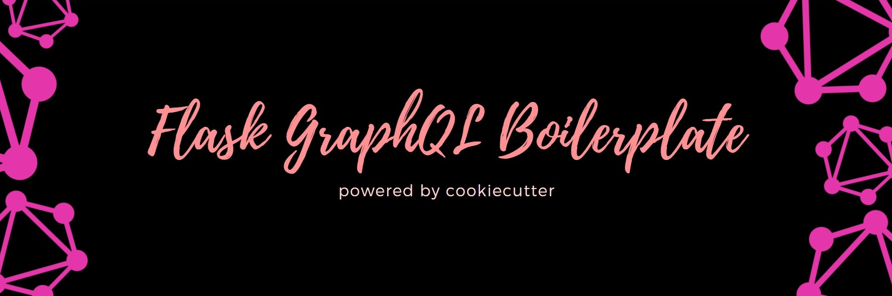

<p align="center">
  
  a Flask template for <a href="https://github.com/cookiecutter/cookiecutter">cookiecutter</a> to get you up and running, powered by GraphQL.
</p>

## Motivation

The GraphQL community is relatively new, and there are fewer resources to help you get started with it in the Python ecosystem. While I started to write
GraphQL projects with Python, I experienced a lot of friction, and wrote a lot of boilerplate code. Eventually, I figured out that it would be easier to
make a template which would help me to get up and running. This template uses a lot of modern libraries to provide the best developer experience. Today, I
mostly start off my projects with this template.

## Features at a glance

> _[x] Built for [Flask](https://github.com/pallets/flask) 2.0.1
> _[x] Works with Python 3.8
> _[x] Uses [Graphene](https://github.com/graphql-python/graphene) for the GraphQL schema.
> _[x] Pre-Configured [Jinja2](https://github.com/pallets/jinja) email templates.
> _[x] Built in support for sending emails.
> _[x] [MongoEngine](https://github.com/MongoEngine/mongoengine) ODM support.
> _[x] Uses [Pipenv](https://github.com/pypa/pipenv) to manage dependencies.
> _[x] Offers complete support for the [Relay](https://github.com/facebook/relay) API spec.
> _[x] GraphQL file uploads support.
> _[x] Uses [Pytest](https://github.com/pytest-dev/pytest) and [Factory-Boy](https://github.com/FactoryBoy/factory_boy) for testing.
> \_[ ] Comes with an authentication system out of the box, which handles:
>
> _[ ] User email confirmation.
> _[ ] Forgot password/ password reset.
> _[ ] User creation/ login.
> _[x] Storing passwords with [Argon2](https://github.com/hynek/argon2-cffi).

## Using the boilerplate

using the boilerplate is very simple! Make sure that you have cookiecutter installed.

```cmd
pip install cookiecutter
```

You can get started by entering the following command.
You'll be asked to enter the project variables.

```cmd
cookiecutter gh:codebyaryan/flask-graphql-boilerplate
```

If you don't want to provide any project variables, you can use this command instead.

```cmd
cookiecutter gh:codebyaryan/flask-graphql-boilerplate --noinput
```

## Contributing

This project is open for contributions! Make sure to read the [contributing guidelines](.github/CONTRIBUTING.md) to get started.
