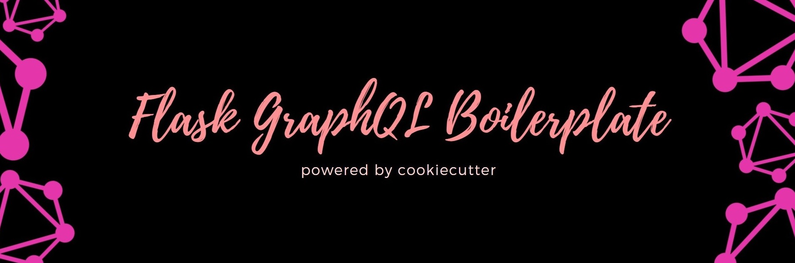

  
  a Flask template for <a href="https://github.com/cookiecutter/cookiecutter">cookiecutter</a> to get you up and running, powered by GraphQL.

## Motivation

the graphQL community is relatively new, and there are fewer resources to help you get started with it in the python ecosystem. While I started to write
graphQL projects with python, I experienced a lot of friction, and need to write a lot of boilerplate code. Hence, I figured out that it would be easy to
make a template which would help me to get up and running. This template uses a lot of modern libraries to provide the best developer experience. Today, I
mostly start off my projects with this template.

## Features at a glance

- [x] built for [Flask](https://github.com/pallets/flask) 2.0.1
- [x] works with python 3.8
- [x] uses [strawberry graphQL](https://github.com/strawberry-graphql/strawberry).
- [x] pre-configured [Jinja2](https://github.com/pallets/jinja) email templates.
- [x] [mongoengine](https://github.com/MongoEngine/mongoengine) ODM support.
- [x] uses [pipenv](https://github.com/pypa/pipenv) to manage dependencies.
- [ ] can serve media files (with Nginx).
- [ ] graphQL file uploads support.
- [ ] uses [pytest](https://github.com/pytest-dev/pytest) and [factory-boy](https://github.com/FactoryBoy/factory_boy) for testing.
- [ ] comes with an authentication system out of the box.

## Contributing

this project is open for contributions! Make sure to read the [contributing guidelines](.github/CONTRIBUTING.md) to get started.
